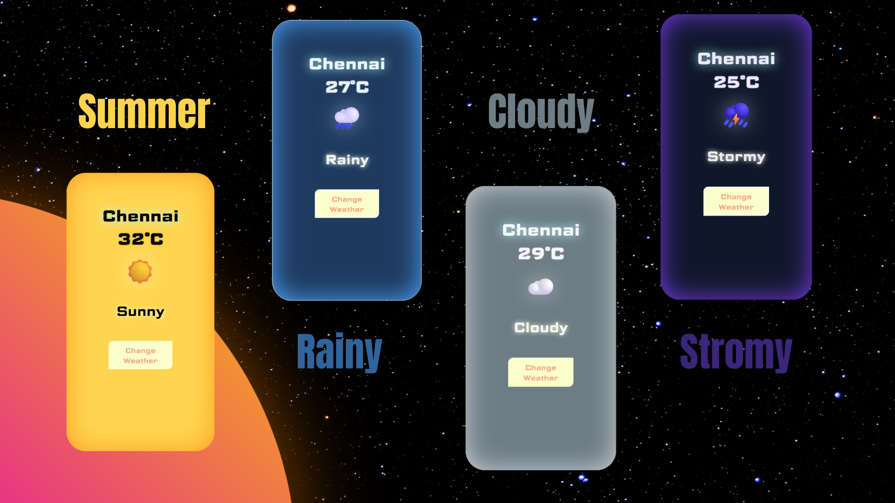

# 🌦️ Weather UI Web App

A simple and visually styled weather interface built using pure HTML, CSS, and JavaScript.  
This project demonstrates dynamic UI updates, theme switching, and interactive design without using any external frameworks.

---

https://jbmsacps-stack.github.io/Weather-UI-Web-App/

## 🚀 Features

- Dynamic weather states (Sunny, Rainy, Cloudy, Stormy)
- Smooth background and glow transitions
- Interactive UI updates using JavaScript
- Hover-based icon animation
- Clean and centered card layout
- Responsive typography and spacing

---

## 🧠 Concepts Used

- DOM Manipulation (`textContent`, `querySelector`)
- Event Handling (`addEventListener`)
- State-based UI design using JavaScript arrays
- CSS Flexbox layout
- CSS transitions and hover effects
- Custom theme switching (background, glow, text)

---

## 🎨 UI Behavior

Clicking the **"Change Weather"** button updates:

- Temperature
- Weather icon
- Condition text
- Background color
- Glow effect
- Text color

Each weather state has its own visual identity.

---

## 🛠️ Technologies Used

- HTML5
- CSS3
- JavaScript (Vanilla)

---

## ⚠️ Limitations

- Uses static weather data (no real API)
- Designed for learning and UI practice
- Not optimized for production use

---

## 👤 Author

JB

---

## 📌 Note

This project was built as part of frontend practice to improve understanding of layout, styling, and JavaScript-driven UI behavior.
